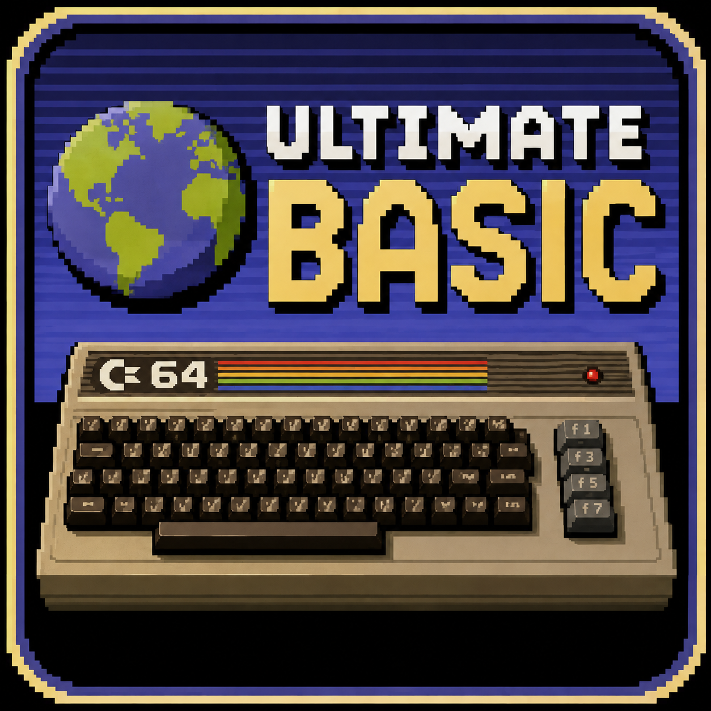

# Ultimate Basic



Current version: **1.5.3**

A modern BASIC-like language that compiles directly to 6502 machine code for the
**Commodore 64** and **Commodore 64 Ultimate**. It produces `.prg` files that run in
VICE or on real hardware, and can also build `.d64` disk images.

Ultimate Basic looks like classic BASIC but compiles ahead of time — no interpreter,
no line numbers required. It adds typed variables (`int`/`word`/`float`/`string`/arrays),
subroutines and functions, structured control flow, and direct, high-level access to the
C64's hardware: bitmap and block graphics, sprites, SID sound and music, raster/CIA/NMI
interrupts, REU transfers, disk I/O, and inline 6502 assembly.

Sprite support includes hardware collision registers, side-effect-free software AABB
tests with `box_hit()`, and frame selection from consecutive sprite animation data.
Use `sprite_frame id, base, frame` inside an animation loop to select successive images
stored in 64-byte slots; it changes the sprite image only and does not animate or move the
sprite automatically.
Character tile maps can be embedded from self-describing `.ubmap` files, rendered as
40×25 viewports, queried and modified at runtime, in normal or multicolor text mode.
Koala Painter images can also be validated, embedded, shown in multicolor bitmap
mode, and hidden again with `koala load`, `koala show`, and `koala hide`.

© 2026 Zsolt Tarczali

## Build

```bash
cargo build --release      # binary: target/release/ub
cargo test                 # unit + integration tests
```

## Usage

```bash
ub build demo.ub -o demo.prg          # compile to a .prg (prints a memory map)
ub build demo.ub -v                   # also print ZP layout + hex dump
ub build demo.ub --debug              # also write .sym, .dbg and .vs symbols
ub build demo.ub --asm                # also write a readable 6502 codegen listing
ub build demo.ub --d64 disk.d64       # also build a .d64 disk image
ub build demo.ub --d64 disk.d64 --add music.prg   # embed extra files in the .d64
```

| Option | Description |
|---|---|
| `-o, --output <file>` | Output `.prg` (default: `<input>.prg`) |
| `-v, --verbose` | Print full zero-page layout and a hex dump |
| `--no-stub` | Skip the BASIC `SYS` stub (code loads at `$0801`) |
| `--debug` | Also produce KickAssembler `.sym`, C64Debugger `.dbg`, and VICE `.vs` files |
| `--asm` | Also produce a readable 6502 codegen listing as `<output>.asm` |
| `--d64 [file]` | Also produce a `.d64` (default: `<output>.d64`) |
| `--add <file>` | Add an extra file to the `.d64` (repeatable) |

With `--debug`, the compiler writes three files beside the program: an importable
KickAssembler `.sym`, a C64Debugger/RetroDebugger `.dbg`, and a VICE monitor `.vs`.
They contain the program boundaries, variables, arrays, subroutines, and BASIC labels.
The `.dbg` export currently provides address symbols but not source-line stepping data.

With `--asm`, the compiler writes a readable assembly listing beside the program. Unlike
a plain disassembly of the finished PRG, it is built from code-generation metadata and
retains UB statement comments, zero-page variable names, array/subroutine/BASIC-label
symbols, generated branch/JMP/JSR labels, instruction addresses, and emitted machine-code
bytes. Compiler-generated helper routines are included in the same listing.
The output uses KickAssembler syntax and can be assembled again. Known data regions—such
as `data`, maps, sprite/character definitions, lookup tables, SID/Koala payloads, and
`incbin` content—are emitted as `.byte` blocks instead of being mistaken for instructions.

## What's new in 1.5.3

- Added **multi-dimensional arrays**. Declare an array with a comma-separated
  dimension list and index it the same way; storage is row-major and the total
  size is the product of the dimensions:

  ```basic
  var grid = array(8, 8)     # 8×8 = 64 bytes
  grid[r, c] = 42            # row-major: base + r*8 + c
  var v = grid[r, c]
  var wm = array_word(4, 4)  # word (16-bit) elements work too
  ```

  Any number of dimensions is supported, dimensions may be `const`s, all-constant
  subscripts fold to a direct address at compile time, and a single subscript into
  a multi-dimensional array is still allowed as flat/linear access.
- Fixed PETSCII string encoding of `[`, `]`, and `^`, which previously printed as
  `?`. They now emit their correct C64 codes (`$5B`, `$5D`, `$5E`) in both the
  uppercase and lowercase charset modes.
- Added `examples/array2d_demo.ub` and integration tests for multi-dimensional
  arrays and the bracket encoding.

## What's new in 1.5.2

- Added `ub build <file.ub> --asm` and `<file>.asm` codegen listings.
- Listings retain UB statement boundaries and compiler symbols instead of producing only
  a bare post-build disassembly.
- Zero-page variables and arrays are emitted as named assembler constants.
- BASIC labels, subroutines, relative branches, and generated in-program JMP/JSR targets
  receive readable labels.
- Every instruction includes its C64 address and generated machine-code bytes, making the
  output useful for inspection, debugging, optimization, and comparison with the PRG.
- Compiler helpers use descriptive `ub_helper_*` labels, while known embedded data is
  emitted with named `.byte` regions in reassemblable KickAssembler syntax.
- Added listing tests and documentation in the README, manual, CLI help, release notes,
  and compiler developer guide.

## A taste

```basic
graphics on
gcls
for i = 0 to 199
  line 0, i, 319, 199 - i
next
display on
var k = getch()
graphics off
bye
```

## Documentation

The complete language and CLI reference lives in **[MANUAL.md](MANUAL.md)** — variables and
types, operators, control flow, subroutines/functions, graphics (bitmap, double-buffered,
block), sprites, sound and SID music, interrupts, REU, disk I/O, string/math functions, and
inline assembly.

Release history is in [whatnews.txt](whatnews.txt).

## Examples

Ready-to-build demos are in [`examples/`](examples/) — bitmap and block graphics, sprite
multiplexing, plasma and orbit effects, a flicker-free double-buffered 3D cube
(`cube_demo.ub`), REU stash/fetch, SID music playback, scrollers, and more.
